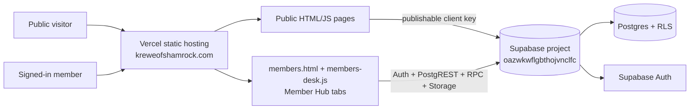
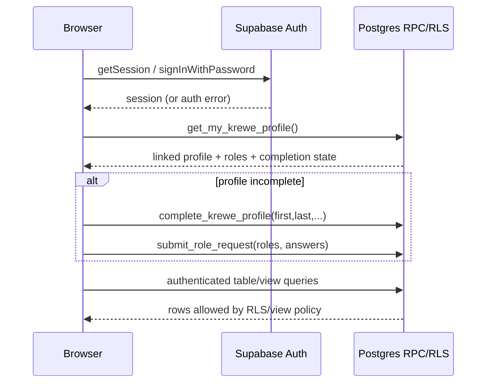

# Krewe of Shamrock — Software Architecture

**Status:** as-built description from the tracked HTML/JavaScript and SQL migrations, reviewed September 2026.

## Scope and operating model

The site is a static HTML/CSS/JavaScript application deployed on Vercel at **kreweofshamrock.com**. There is no application server, build step, package manifest, or server-side route in this repository. Pages are served as files; browser modules import Supabase JS from a CDN and call the Supabase web API directly.

The public site is separate from the authenticated Member Hub. Public pages can read deliberately public Supabase data (events and published content) or are purely static. `members.html` is the hub shell: it owns the email/password gate and loads the hub tabs and feature code, including `assets/members-desk.js`.

## Frontend components

### Public site

Static pages include the home, heritage/history, parade, Tartan Ball, volunteer, store, membership application, gallery, poetry, video, event, raffle, and sharing experiences. Shared presentation behavior lives in `assets/krewe.css` and `assets/krewe.js`. Data-backed public pages use browser Supabase clients to read:

- `events` for public/upcoming events (filtered by `is_public`; IKC-sourced events are displayed but excluded from Krewe RSVPs).
- `content_items` for published poems, art, gallery, video, and other submitted content.
- `v_raffle_events_public` and `v_raffle_baskets_public` for the public raffle page and QR sheet.

The public membership form calls `submit_membership_application`. The event form calls `rsvp_to_event`, which also creates/updates a prospect roster row when appropriate and queues confirmation email work. Public raffle entry uses the deployed public raffle RPCs; the QR page is intentionally a lightweight public entry point.

### Member Hub

`members.html` provides the auth, first-login profile, password recovery, sign-out, tour, base cards, reports modal, Craic Cup modal, and raffle modal. `assets/members-desk.js` transforms the base cards into tabs:

- Home — standing, Parade Ready status, approved volunteer hours, and next actions.
- My Krewe — the signed-in profile, directory, and governing-document links.
- Events — event signup/RSVP link and attendance context.
- Parade Day — Parade Ready requirements and volunteer-hour entry.
- Give Back — volunteer-hour view/logging.
- Fun — Craic Cup, raffles, sharing, and coordination cards.
- Officer desk — approvals, reports, and payment feed for officers.

The hub also includes locker requests, carpools, van pools/reservations, a member directory, officer reports, rich profile editing/photo upload, basket and 50/50 raffle participation, raffle management, and the Craic Cup standings/badges.

## Authentication and identity

Supabase Auth is configured for email + password in the page code:

- `members.html` calls `getSession`, `signInWithPassword`, `resetPasswordForEmail`, `updateUser`, `onAuthStateChange`, and `signOut`.
- First login calls `get_my_krewe_profile`; an incomplete profile is completed with `complete_krewe_profile`, then any claimed elevated roles are submitted with `submit_role_request`.
- The database trigger/profile functions link an Auth user to `members` by case-insensitive email. A roster match grants ordinary hub access; elevated access is separately represented in `member_roles` and confirmed through the Officer desk.
- `is_krewe_officer()` is the server-side officer gate. It honors explicit `member_roles` grants and an active roster role (`officer`, `captain`, or `board`).

The client contains only the Supabase project URL and a **publishable** key. No service-role key belongs in this repository or in a browser. Password recovery and auth redirect allow-lists are Supabase Dashboard configuration, not repository code.

## Data layer

The frontend uses PostgREST table/view queries for reads and narrowly named RPCs for workflows. The following is the browser-facing contract observed in code; the deployed database also contains older/base objects whose original migrations are not all present in this repository.

### Tables and views queried directly

- **Identity and directory:** `members`, `profiles` (through server functions), `member_directory`, `v_member_profiles`, and `v_report_membership`.
- **Events and attendance:** `events`, `event_signups`, `v_event_headcount`, `v_event_attendee_emails`, `waivers`, and `volunteer_hours`.
- **Parade readiness:** `v_parade_ready` (dues, waiver, mandatory-meeting attendance, logged/approved hours), plus `meeting_checkin_codes` behind officer RPCs.
- **Coordination:** `lockers`, `carpools`, `vanpools`, and `vanpool_reservations`.
- **Dues, reports, and messaging:** `dues_payments`, `v_report_dues_summary`, `v_outstanding_dues`, `v_pending_applications`, `content_items`, and `outbound_emails`.
- **Craic Cup:** `badge_defs`, `v_season_leaderboard`, and `v_volunteer_leaderboard`; ledger/badge writes are server-side.
- **Raffles:** `v_raffle_events_public` and `v_raffle_baskets_public`; ticket and draw tables are accessed through RPCs rather than directly from the browser.
- **Payments:** `payments` is officer-readable through `list_recent_payments`; the browser does not write the ledger.

### RPCs called by the frontend

The main auth/profile and officer workflows are `get_my_krewe_profile`, `complete_krewe_profile`, `submit_role_request`, `update_my_member_profile`, `is_krewe_officer`, `list_officer_approvals`, `approve_role_request`, `deny_role_request`, `merge_members`, `dismiss_duplicate`, and `list_recent_payments`.

Events and parade readiness use `rsvp_to_event`, `meeting_check_in`, `officer_review_hours`, `officer_upsert_meeting`, and `officer_enable_checkin`. The public membership form uses `submit_membership_application`.

Craic Cup uses `get_member_game_card`. Raffles use `get_my_raffle_summary`, `enter_basket_as_member`, `buy_5050_as_member`, `get_my_raffles`, `create_raffle`, `add_basket`, `update_basket`, `delete_basket`, `draw_basket_winner`, and `draw_5050_winner`. Some officer/report RPCs and base-schema functions are deployed but are not defined in the SQL files currently tracked here.

Storage-backed features use the public `avatars` bucket for member profile photos (members write only to their own Auth-UID folder) and the `raffle-baskets` bucket for basket photos. Public URLs are intentional for these images; do not place private documents in those buckets.

## Feature behavior

### Parade Ready and hours

A member's current-season readiness is the conjunction of dues paid, liability waiver signed, and mandatory meeting attended. `v_parade_ready` supplies the status and 12-hour progress. Members insert their own `waivers` and `volunteer_hours`; officers approve hours via `officer_review_hours`. Officers can schedule mandatory meetings and generate check-in QR codes through the officer RPCs. A QR link landing on `members.html?checkin=...` survives the auth flow and calls `meeting_check_in`.

### Events and directory

Public events are read from `events` under the public-event policy. RSVP is server-side through `rsvp_to_event`, with capacity/waitlist calculation and outbound-email queueing. The signed-in directory is deliberately reduced to member names/roles, while `v_member_profiles` supplies the richer profile presentation for authenticated users. Profile editing is constrained to the current member through `update_my_member_profile`; role/status/title changes are officer functions, not member-editable fields.

### Raffles and Craic Cup

Raffles expose public read views and member ticket RPCs. Officers can draw winners; raffle creators can manage their own raffles, subject to server authorization. The Craic Cup renders season standings, volunteer standings, rank thresholds, badge definitions, and a member card. Point and badge awarding is database-side; the browser displays results and does not award itself points.

### Officer desk

The Officer desk is a UI convenience only; the database repeats the authorization checks. It contains role/duplicate approvals, payment visibility, Parade Readiness reports, membership/dues reports, event/attendance reports, logistics reports, and content/communications inventory. Reports marked officer-only are gated in JavaScript and by RLS/view/function authorization.

## Security model

1. **Browser key:** only the Supabase publishable key is embedded in static pages. It is not a secret boundary; RLS and function authorization are the boundary.
2. **Auth and RLS:** signed-out users cannot use member-only workflows. Public policies are limited to intentionally public events/content/raffle surfaces. Member and officer tables use RLS for self/member-vs-officer scoping.
3. **RPC authorization:** sensitive writes are `SECURITY DEFINER` functions with explicit `auth.uid()`/role checks; anonymous execute is revoked for internal profile, approval, merge, and officer helpers. The payment ledger is written by the webhook/service-role path and read by officers through a guarded function.
4. **Views:** `v_parade_ready` is documented as a security-invoker view so its row visibility follows the caller's RLS. The tracked profile migration explicitly sets `v_member_profiles` and `member_directory` to owner execution while granting them only to authenticated users; they intentionally expose no email/phone and omit hidden/prospect/merged records. This difference is important when reviewing the deployed schema rather than assuming every view has the same mode.
5. **Output escaping and identity:** frontend renderers escape displayed data. Coordination forms derive name/email from the signed-in profile after unlock; member profile updates cannot change role, status, or title.
6. **Contact/support:** the public contact and website-problem address is `kreweofshamrocktampa@gmail.com`.

## Deployment

- Vercel serves the repository root as static assets; there is no compile/build artifact to publish.
- The custom domain is `kreweofshamrock.com`; Supabase Auth Site URL and redirect allow-lists must match the production and approved preview URLs in the Supabase Dashboard.
- The repository's `.vercelignore` excludes Markdown planning files from the deployment. Dashboard settings, domain DNS, Vercel project linkage, Supabase Auth provider settings, storage policies, cron, and Edge Functions are external deployment state.
- The IKC calendar sync is a server-side Supabase function/pg_cron job, not a browser job. It imports future events from the external iCalendar feed and marks them with `source = 'ikc'`.

## Known gaps and boundaries

- The repository is not a complete database migration history. Several base tables/views/RPCs used by `members.html` (including reports, raffle, gamification, and parts of Parade Ready) are deployed dependencies without their full originating DDL in the tracked `sql/` directory. Validate changes against the live Supabase project before treating this document as a schema migration plan.
- Vercel custom-domain/DNS state, automatic GitHub deployment wiring, Supabase email deliverability/SMTP, and Edge Function secrets are not represented in static source.
- Public raffle entry is intentionally a browser-facing flow and payment reconciliation is operational; the frontend does not verify in-person payment.
- The client uses CDN imports of Supabase JS. Pinning the major version is not the same as vendoring the dependency.
- This document describes code and tracked migrations, not a claim that every dashboard or database setting has been independently re-verified.
