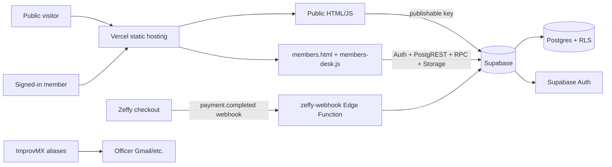
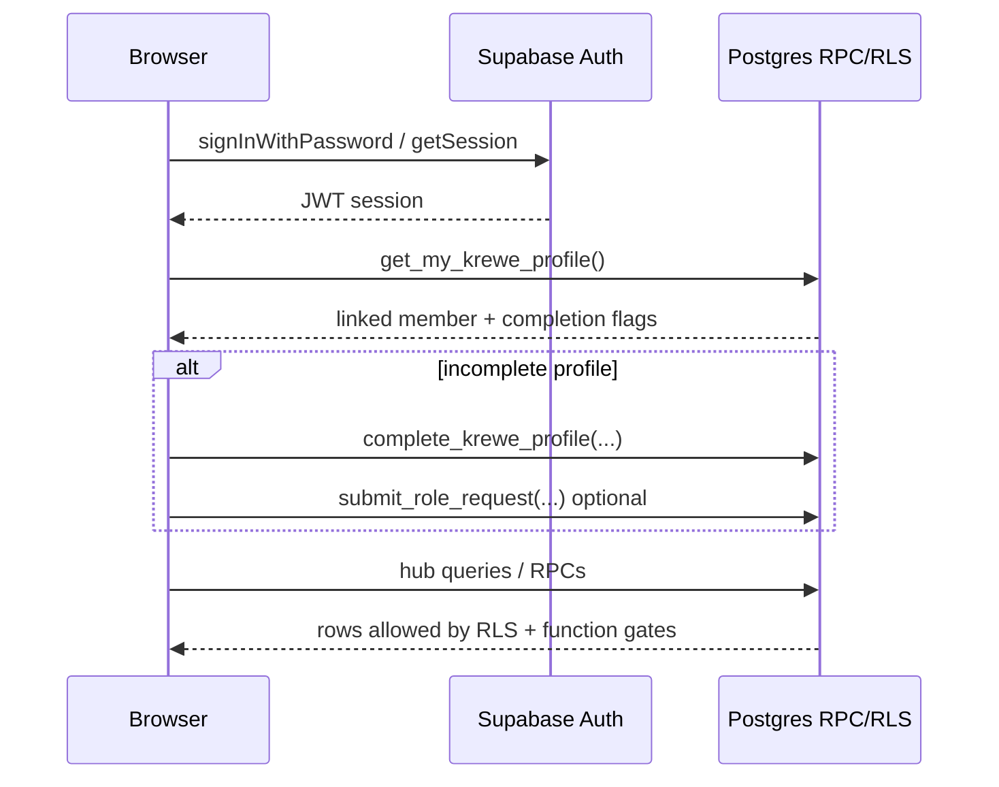

# Krewe of Shamrock — Software Architecture

**Audience:** software engineer receiving a technical handoff  
**Product:** [kreweofshamrock.com](https://www.kreweofshamrock.com) (Krewe of Shamrock, Tampa Bay)  
**Repo:** [MissTully/Shamrock](https://github.com/MissTully/Shamrock)  
**Status:** as-built, reviewed **2026-09-08**  
**Related product:** Krewe & Kin (kreweandkin.com) — this Shamrock site is the living adoption/migration case.

---

## 1. Executive summary

The site is a **static HTML/CSS/JavaScript** application on **Vercel**. There is **no** application server, build step, or `package.json` in this repo. Pages are served as files. The browser imports `@supabase/supabase-js` from a CDN and talks to **Supabase** (Auth + Postgres + PostgREST + Storage + Edge Functions) with the **publishable** client key only.

| Layer | Choice |
|---|---|
| Hosting / CDN | Vercel → `kreweofshamrock.com` |
| Backend | Supabase project `oazwkwflgbthojvnclfc` (us-east-1) |
| Auth | Supabase Auth (email + password) |
| Payments | Zeffy (external checkout) → `zeffy-webhook` Edge Function → `payments` ledger |
| Role email | ImprovMX forwards on `kreweofshamrock.com` |
| Domain | Registrar (historically GoDaddy); DNS points at Vercel |

**Operating constraint:** Cursor cloud coding agents are unavailable on the current plan for this repo. Ship code via GitHub Contents API / git push to `main` (Production auto-deploys) and schema via Supabase MCP / SQL migrations.

---

## 2. Today’s stack cost (approx.)

| Piece | What it does | Likely cost |
|---|---|---|
| **Supabase** | Auth, database, Edge Functions | **$0** on Free (this org’s create-cost reads $0). **Pro ~$25/mo** + compute if you upgrade for no-pause + leaked-password protection |
| **Vercel** | Hosts kreweofshamrock.com | **$0** Hobby works for light traffic; **~$20/seat/mo** Pro if you treat it as commercial / need higher limits |
| **ImprovMX** | secretary@ / digital@ / etc. forwards | **$0** Free (1 domain, 25 aliases, 500 forwards/day) |
| **Zeffy** | Dues, shop, tickets | **$0 to the Krewe** — donors may optionally tip Zeffy |
| **Domain** | kreweofshamrock.com | Whatever GoDaddy (or registrar) renewal is — usually **~$12–20/yr** for `.com` |

**Soft-launch ballpark:** about **$0–20/month** platform fees + annual domain renewal if free tiers are kept.

**Cost watch-outs**

- Supabase Free projects can **pause** after inactivity; Pro removes pause and unlocks HaveIBeenPwned password checks.
- Vercel **Hobby is non-commercial** by ToS; a nonprofit site with shop/dues may need **Pro**.
- ImprovMX Free caps at **500 forwards/day**.

---

## 3. Repository layout (what to touch)

| Path | Role |
|---|---|
| `index.html`, `learn.html`, `store.html`, `event-signup.html`, … | Public pages |
| `members.html` | Member Hub shell (auth gate, modals, directory, reports, Craic Cup UI) |
| `assets/krewe.css` / `assets/krewe.js` | Shared public chrome (nav, footer social/contact inject, music, hub script loader) |
| `assets/members-desk.js` | Hub tabs, Home Craic hero, profile, Event Studio hooks, payments card |
| `assets/kos-*.js` | Officer Event Studio / reports / shop studio helpers |
| `*.md` | Runbooks (payments, shop, events, dues, Tartan Ball, etc.) — **do not ship internal docs publicly** (see `.vercelignore`) |
| Supabase | Schema + RPCs live in the hosted project (not a full `supabase/migrations` tree in every clone) |

**Deploy:** push to `main` → Vercel Production. Prefer small file commits. Cache-bust `members-desk.js` via query string in `krewe.js` when hub JS must refresh clients.

---

## 4. Frontend architecture

### 4.1 Public site

Static marketing/heritage/events/store/membership pages. Shared footer inject (via `krewe.js`):

- **Public Facebook Group:** `https://www.facebook.com/groups/kreweofshamrock`
- **Contact:** `secretary@kreweofshamrock.com` only (no “report to digital@” in footer)

Public data reads (publishable key + RLS/RPC):

- `events` — public/upcoming; **`source = 'krewe'`** for Krewe-hosted RSVP/Clovers; `source = 'ikc'` shown on calendars but **not** RSVP/Clover quests
- `content_items` — published poems/art/gallery/video
- Shop: `list_public_shop_products()`
- RSVP: `rsvp_to_event(...)` (anon allowed; awards **+5 Clovers** once per member/event when `source = 'krewe'` and status is registered/confirmed)

### 4.2 Member Hub

`members.html` owns:

- Email/password gate, password recovery, session wiring
- First-login welcome (photo + name + light prompts; role claim tucked away)
- Directory (`v_member_profiles` → photo-first people cards, A–Z groups)
- Reports / Craic Cup / raffle modals
- Media/likeness consent gating for Share

`assets/members-desk.js` builds tabs:

| Tab | Purpose |
|---|---|
| **Home** | Craic Cup hero (rank, Clovers, progress, shamrock flourishes), **Next Easy Win** multi-card Shamrock-hosted events, soft Member desk strip; officers also see Officer desk card |
| **My Krewe** | Your profile (incl. **members-only Facebook** `https://www.facebook.com/groups/1790675004521855`), directory, governing docs |
| **Events** | Calendar / RSVP entry |
| **Member desk** | Parade Ready, dues/waiver cues, volunteer hours |
| **Fun** | Craic Cup, content share, coordination toys |
| **Officer desk** | Approvals, reports, Event Studio, Shop Studio, payments (treasurer+board via `can_view_payments`) |

**Product north star (locked 2026-09-07):** Member Hub front door is the **Craic Cup as a game**. Welcome stays light. Dues/waiver/hours live on Member desk. Directory = people, not a spreadsheet. Soft-launch = board/chairs before mass krewe invites.

---

## 5. Authentication and identity

- Auth users link to `members` by **case-insensitive email**.
- Roster match → ordinary hub access.
- Elevated access: `member_roles` + officer approval queue; server gate `is_krewe_officer()`.
- Payments visibility: `can_view_payments()` — **treasurer + board only**.
- Event management: `can_manage_events()`.
- Client must **never** contain the service-role key.

**Known soft-launch identities (roster Auth emails):**

- Deb (Secretary): `dgfitzpa@gmail.com` — `secretary@` ImprovMX → Deb  
- Tim (Treasurer): `tim.fitzpatrick@lumen.com` — `treasurer@` forwards via ImprovMX  
- Patrick (Owner): `ppustay1@gmail.com` — `patrick@`  
- Digital/tech: `digital@` → `melissa@encountive.com`  
- Public contact: prefer `secretary@kreweofshamrock.com`

---

## 6. Data layer (engineer contract)

### 6.1 Core tables (non-exhaustive)

| Area | Objects |
|---|---|
| Roster | `members`, `profiles`, `member_roles`, `role_requests` |
| Events | `events` (`source` krewe\|ikc), `event_signups` |
| Parade Ready | waivers, dues, mandatory meeting flags; `v_parade_ready` |
| Hours | `volunteer_hours` |
| Content | `content_items`, `media_consents` |
| Shop | `shop_products` (+ Zeffy URL attach flow) |
| Payments | `payments` (+ `kos_record_payment`) |
| Craic Cup | `clover_ledger`, `badge_defs`, `member_badges`, `craic_rank()`, `get_member_game_card()` |
| Ops | Tartan Ball orders/guests, dues reminder log, outbound email queue |

### 6.2 RPCs — public vs authenticated

**Intentionally callable by `anon` (after 2026-09-08 hardening):**

- `rsvp_to_event`
- `list_public_shop_products`
- `submit_role_request`

**Privileged SECURITY DEFINER RPCs:** `EXECUTE` revoked from `PUBLIC`/`anon`; granted to `authenticated`. Function bodies still enforce `is_krewe_officer()` / `can_manage_*` / `can_view_payments()`.

**Do not expose from the browser:** `enqueue_email` — API execute revoked; only internal definer callers.

### 6.3 Craic Cup rules (current)

- Ranks (lifetime Clovers): Newcomer → Clansfolk (100) → Bard (300) → Chieftain (700) → Highland Champion (1500).
- **+5 Clovers** on first successful RSVP to a **`source = 'krewe'`** event (`reason = 'rsvp'`); unique partial index prevents double award; no Clovers for IKC / waitlist.

### 6.4 Views

Officer/report views were switched to **`security_invoker = true`** (2026-09-08) so caller RLS applies. Prefer gated RPCs for sensitive exports.

---

## 7. Integrations

| System | Integration point | Notes |
|---|---|---|
| **Zeffy** | Checkout links on site/store; webhook → `zeffy-webhook` | JWT verify **OFF** on webhook; shared token secret; known backlog: amount double-convert / email matching |
| **ImprovMX** | DNS MX for kreweofshamrock.com | Free forwarding preferred over paid mailboxes |
| **IKC calendar** | Events with `source = 'ikc'` | Display only; no Krewe RSVP / Clovers |
| **Gmail** | Soft-launch board email drafts | Human sends; automation digests are dry-run until enabled |

Automations (agent-side, not in-repo cron unless noted):

- Dues reminders 2027 — weekday 9:00 AM ET dry-run digest  
- Zeffy shop weekly batch — Tuesday 10:15 AM ET  

---

## 8. Security model (as-built 2026-09-08)

| Control | Status |
|---|---|
| HTTPS (Vercel) | Yes |
| Publishable key only in browser | Yes |
| RLS on member data | Yes (policies evolve; check advisors) |
| Officer/payment gates inside RPCs | Yes |
| Anon execute on officer RPCs | **Revoked** (kept only public RSVP/shop/role-request) |
| Report views | `security_invoker` |
| `enqueue_email` from API | **Revoked** |
| Leaked-password (HIBP) | **Off** — Pro Dashboard toggle if upgraded |
| Soft-launch posture | Board/chairs before mass invites |

Remaining advisor noise is mostly “authenticated can call SECURITY DEFINER RPCs” (expected; bodies gate) and Free-tier tables with RLS-on/no-policy (locked closed).

---

## 9. Deployment & environments

| Item | Value |
|---|---|
| GitHub | `MissTully/Shamrock` · default branch `main` |
| Production URL | https://www.kreweofshamrock.com |
| Supabase ref | `oazwkwflgbthojvnclfc` |
| Deploy | Push/`gh` Contents API to `main` → Vercel Production |
| Schema | Supabase `apply_migration` / SQL (MCP or Dashboard) |

**Handoff tip:** treat `main` as production. Prefer migrations that are idempotent. After hub JS changes, bump `assets/members-desk.js?v=…` in `krewe.js`.

---

## 10. Operational runbooks (in-repo)

| Doc | Topic |
|---|---|
| `PAYMENTS_SETUP.md` | Zeffy webhook + ledger |
| `SHOP_STUDIO.md` | Merch / Zeffy campaign queue |
| `EVENT_STUDIO.md` | Officer event tooling |
| `DUES_REMINDER_AUTOMATION.md` | 2027 dues digests |
| `MEMBER_HUB_SETUP.md` / `MEMBER_PROFILES.md` | Hub & profiles |
| `GAMIFICATION_DESIGN.md` | Craic Cup design notes |
| `TARTAN_BALL.md` | Ball ops / labels |
| `REPORTS.md` | Officer reports |
| `QR_FEATURE_SOLUTIONS.md` | Member & officer QR feature solutions + Attendance QR Studio plan |
| `DEPLOYMENT_PLAN.md` | Launch readiness history |
| `DATABASE_BACKEND.md` | Earlier schema narrative |

---

## 11. Known gaps / backlog (honest)

- Zeffy webhook **amount / email matching** quirks on Officer Payments ledger.
- Dues reminder emails still **dry-run** until explicitly enabled.
- Supabase Free pause risk; HIBP needs Pro.
- Vercel Hobby vs commercial ToS — plan Pro before heavy public traffic.
- Cloud agents unavailable for this repo — ship via GitHub + Supabase directly.
- Some older SQL migrations may not all live in-repo; **hosted DB is source of truth** for schema.
- **QR feature solutions** catalogued in `QR_FEATURE_SOLUTIONS.md`. Officer desk **QR Solutions pack** generates Live/Pack squares; still planned: Attendance QR Studio (scan → attendance + volunteer hours), per-event RSVP QR, Tartan guest card, wristband station, locker sticker, per-SKU store QR.

---

## 12. Quick start for a new engineer

1. Clone `MissTully/Shamrock`; skim this file + `DEPLOYMENT_PLAN.md` + `PAYMENTS_SETUP.md`.
2. Get Supabase Dashboard access to `oazwkwflgbthojvnclfc` (Auth redirect URLs, Edge Function secrets, SQL).
3. Get Vercel project access for `kreweofshamrock.com`.
4. Local preview: any static server on the repo root is enough (no build).
5. Test Member Hub with a roster-matched Auth user; never use service-role in the browser.
6. For schema: write a named migration; verify with `get_advisors` (security) after privilege changes.
7. Soft-launch rule: **board first**, mass krewe blast on hold until product owner says go.

---

*Document owner: Krewe digital / Encountive. Last updated 2026-09-09.*
